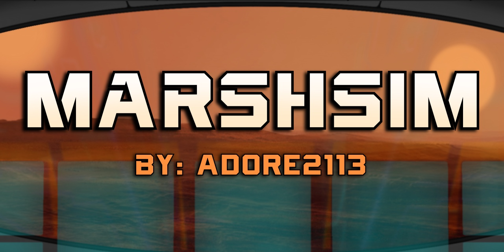

# ♡ MarsHSim ♡

I'm building a Mars habitat simulation where a closed system keeps a crew alive with no resupply, one subsystem at a time.

♡--------------------------------------------------♡

MarsHSim models a self sustaining Environmental Control and Life Support System (ECLSS) for a crew of 30 inside a closed 2000 m3 habitat on Mars.

The focus is on reliability, realism, machine learning integration, reusability, and eventually cost considerations.

♡--------------------------------------------------♡

## Overview:

MarsHSim simulates a habitat in Arcadia Planitia running on Mars time (sols and LMST).

The system updates continuously using a timestep based simulation (currently 5 minute intervals), modeling how a closed life support system maintains stability over time.

My goal is to build something that feels real, structured, autonomous and slighlty interactive on a UI I designed

♡--------------------------------------------------♡

## Systems:

### Atmospheric gases:
♡  -oxygen (o2)  
♡  -carbon dioxide (co2)  
♡  -nitrogen (n2)  
♡  -argon (ar)  

### Core life support:
♡  -amine swing beds  
♡  -oxygen generation assembly (OGA)  
♡  -water electrolysis  
♡  -major constituent analyzer (MCA)  

### Environmental systems:
♡  -temperature (Celsius)  
♡  -power  
♡  -water  
♡  -food supplies  
♡  -crew metabolism  
♡  -day and night behavior 

♡--------------------------------------------------♡   
    
## Planned Features:

♡  -emergency scenarios  
♡  -pressure leaks  
♡  -crew illness affecting environment  
♡  -dust storms  
♡  -extreme temperature shifts  
♡  -interactive monitoring and control interface  

♡--------------------------------------------------♡

## Current Focus:

♡  -building core systems one at a time  
♡  -keeping outputs clean and readable  
♡  -making each subsystem behave consistently  
♡  -laying the foundation for future AI control  

This project is in active development.

♡--------------------------------------------------♡

## Project Structure:
    
♡ -src/-

♡ -sim/-

♡ --engine.py--             main simulation loop and system coordination
♡ --state.py               habitat state and tracked variables

♡ --mars_time.py--           Mars time, sols, and LMST handling

♡ --crew_metabolism.py--     crew O2 consumption and CO2 production

♡ --oxygen_system.py--       OGA and oxygen generation logic
♡ --co2_scrubber_system.py-- amine bed CO2 removal system
♡ --buffer_gas_system.py--   nitrogen and argon pressure balancing

♡ --power_system.py--        solar, battery, and power usage
♡ --temp_system.py--         thermal control and heat modeling
♡ --water_system.py--        water usage and tracking
♡ --quick_test.py--          simulation entry point

♡ -docs/-
♡ --v1_scope.md--            creation log and development notes
♡ --v1_state_variables.md--  reference of all tracked variables

♡ -requirements.txt--        project dependencies
♡ -gitignore--               ignored files
♡ -README.md--               project overview

♡--------------------------------------------------♡ 

## Running the Simulation

This currently runs as a terminal based simulation.

Make sure Python is installed, then run:
    py -m src.sim.quick_test

♡--------------------------------------------------♡

## Why this project:

I wanted to build something that feels real, and something I was genuinely interested in and excited about.

MarsHSim started as a way to explore how a closed life support system actually behaves over time, not just as isolated calculations but as a connected system where everything affects everything else.

Instead of solving problems individually, this project focuses on how systems interact, drift, stabilize, learn, and fail.

My long term goal is to move toward a simulation that can support autonomous decision making and eventually integrate machine learning for prediction and control, while keeping it slightly interactive to make it more engaging.

For a more detailed breakdown of how this is being built step by step, see my raw development log that I update as I work on it:

docs/v1_scope.md

-Adore2113 ♡