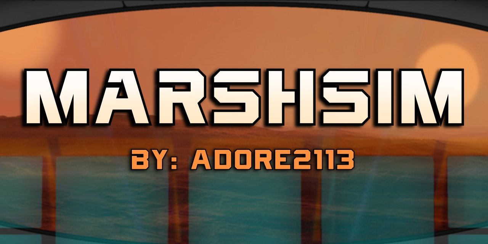

# ♡ MarsHSim ♡

**major subsystem rewrite and settlement redesign in progress**

**visuals / web based design currently on hold**

I'm building a Python based simulation of a permanent first settlement habitat on Mars, designed to support a crew of 30 with no resupply.

MarsHSim began as a closed loop Environmental Control and Life Support System (ECLSS) simulator. As the project developed, it expanded past keeping the crew alive to explore what they would need to live, work and remain psychologically well inside a permanent settlement.

The ECLSS remains the heart of the project, connecting atmosphere, water, power, thermal control, food production, crew metabolism and resource recovery into one continuously changing system.

♡♡♡

MarsHSim is set in Arcadia Planitia at 47° North, 184° East.

The focus is on realistic subsystem behavior, reliability, long-term habitability, resource reuse, autonomous operation and future machine-learning integration

## Overview:

MarsHSim simulates the interconnected systems of a permanent first Mars settlement for 30 people.

The settlement is centered around one compact pressurized habitat containing crew living spaces, food production, life support equipment, power production, environment resourcing, resource storage, maintenance areas and shared community spaces. External infrastructure includes the solar field and water and atmospheric ISRU systems.

The simulation runs continuously using Mars sols, Local Mean Solar Time (LMST) and timestep-based updates.

Instead of than modeling a collection of isolated calculations, MarsHSim focuses on whether the settlement's systems can work together to keep the crew alive, maintain stable conditions and support long-term habitation without resupply.

> **Notice:** MarsHSim is currently undergoing a major subsystem rewrite. The simulator runs, but some systems are still being reconnected and calibrated, so certain outputs and alerts may not yet reflect the intended behavior.

♡♡♡

My goal is to build something that feels real, grounded, structured, autonomous and potentially slightly interactive on a UI.

## Dashboard

MarsHSim includes an early browser-based monitoring dashboard.

The current dashboard is a visual prototype designed to display the simulator's state in a more immersive way than the terminal output. It reads simulation data exported to JSON and shows the important habitat systems and information.

**Note:** dashboard development is currently on hold while I focus on the major subsystem rewrite.

## Systems:

#### Atmospheric gases:
♡ oxygen (O₂)

♡ carbon dioxide (CO₂)

♡ nitrogen (N₂)

♡ argon (Ar)

#### Core life support:
♡ amine swing beds

♡ oxygen generation assembly (OGA)

♡ water electrolysis

♡ Sabatier reaction system

♡ major constituent analyzer (MCA)

♡ buffer gas management

#### Environmental systems:
♡ habitat temperature control

♡ radiator cooling

♡ heater systems

♡ humidity control

♡ day/night thermal behavior

♡ Mars solar cycles 

#### Resource systems:
♡ power generation and battery storage

♡ water storage and recovery

♡ hydrogen byproduct storage

♡ atmospheric pressure stabilization

♡ hydroponic greenhouse

♡ water In-Situ Resource Utilization (ISRU)

♡ deployable subsurface extraction systems

♡ atmospheric intake and compression

♡ sorbent bed gas separation

♡ atmospheric gas storage

#### Crew and Habitability:
♡ crew metabolism

♡ oxygen consumption and CO₂ production

♡ crew heat generation

♡ day and night behavior

♡ crew scheduling and sleep periods

♡ permanent private crew quarters

♡ customizable personal geometric domes

♡ shared dining, recreation and community spaces

♡ long term comfort and psychological considerations

#### Settlement Design:
♡ permanent central habitat for a crew of 30

♡ compact rounded square external structure

♡ isolatable internal functional zones

♡ two level terraced crew quarter area

♡ 32 private crew quarters, including 2 flexible unassigned rooms

♡ Hive-8 Arcadia hydroponic greenhouse

♡ food preparation, preservation, storage and communal dining areas

♡ maintenance, repair and spare part facilities

♡ external solar and ISRU extraction

♡ long term operation without resupply

## Planned Features:
♡ environmental monitoring

♡ emergency scenarios

♡ pressure leaks

♡ crew illness

♡ plant disease

♡ dust storms

♡ extreme temperature shifts

♡ interactive monitoring and control interface

## Current Focus:
♡ reconnecting and testing subsystem interactions during the current rewrite

♡ refining system balancing, constants and resource flows

♡ redesigning the original habitat as a permanent first settlement for 30 people

♡ planning internal habitat zones, crew spaces and long-term habitability features

♡ expanding closed-loop water, atmosphere, power and food management

♡ improving terminal output

♡ laying the groundwork for future autonomous and AI-assisted habitat oversight

This project is in active development.

## Project Structure:
♡ docs /

    - dev_log.md = active development log and my thought process
    
    - todo.md = planned systems, ideas, fixes and future tasks

    - v1_scope.md = project info and notes

    - v1_state_variables.md = reference of all tracked variables
    
♡ docs / notes
    - atmosphere.md = future atmosphere design notes
    
    - hab_water.md = overall habitat water design notes

    - isru.md = future ISRU atmosphere and water notes

    - layout.md = future habitat structure and layout notes

    - lights.md = habitat lighting design notes
    
    - power.md = habitat power system design and simulation notes
    
    - sabatier.md = sabatier design notes

    - solar_field.md = solar field design, operation and power generation notes

    - template.md = my own template I'm using for note structure

    - water_process.md = UPA, BPA and WPA design notes

♡ docs / notes / greenhouse /

    - crops.md = crew nutrition targets and crop planning

    - gases.md = greenhouse photosynthesis, respiration, CO₂/O₂ exchange rates and zone gas calculations

    - hydroponics.md = greenhouse operation and management notes

    - layout.md = Hive-8 Arcadia structure, dimensions, zones and physical layout

    - lighting.md = greenhouse natural and artificial lighting plan

    - power.md = greenhouse power requirements and energy planning

    - water.md = greenhouse water use, recovery and hydroponic water planning

    - zone_overview.md = raw zone values and overview (in progress)

♡ src /sim /

    - alerts.py = simulation alerts and warning systems (very incomplete, not a main focus right now)

    - buffer_gas.py = nitrogen and argon pressure balancing

    - co2_scrub.py = amine swing bed CO₂ scrubbing

    - crew.py = crew metabolism and environmental impact

    - dust.py = dust accumulation and environmental dust effects

    - engine.py = main simulation loop and subsystem coordination

    - greenhouse.py = hydroponic greenhouse systems

    - isru_atm.py = atmospheric intake, sorbent bed CO₂ capture, and N₂/Ar extraction

    - isru_water.py = water ISRU extraction and raw water storage

    - mars_time.py = Mars sols, LMST, and day/night cycles

    - oxygen.py = oxygen generation assembly (OGA) and electrolysis

    - power.py = solar, batteries, power distribution and power consumption

    - print.py = terminal display and simulation output formatting

    - run.py = simulation entry point and testing environment

    - sabatier.py = CO₂ conversion and methane production systems

    - state.py = habitat state and tracked simulation variables

    - temp.py = habitat thermal control and heat modeling

    - ui_export.py = writes the latest simulation state and subsystem outputs to the latest.json

    - water.py = water storage, recovery, and usage tracking

♡ .gitignore = ignored files

♡ README.md = project overview

♡ requirements.txt = project dependencies

♡ ui /

    - index.html = dashboard page structure

    - dashboard.css = dashboard layout, panel styling, and visual design

    - dashboard.js = loads simulation JSON data and updates dashboard panels

♡ ui / data /

    - latest.json = most recent simulation state for the dashboard

    - history.json = saved simulation history over time

## Running the Simulation

My simulator includes a browser-based dashboard, but can also be run as a terminal based simulation.

### 1. Make sure Python is installed, then run:
    py -m src.sim.run

-this will run the terminal based simulation-

### 2. Run:
    python -m http.server 8000

### 3. Open dashboard:

**Notice:** MarsHSim is currently undergoing a major subsystem rewrite, so dashboard development is currently on hold.

Open a new tab in your browser and go to:

    http://localhost:8000/ui/

The dashboard displays the latest simulation output from `ui/data/latest.json`.

-automatic dashboard refreshing is still being implemented-

## Why this project:

I wanted to build something that feels real, and something I was genuinely interested in understanding and excited about.

MarsHSim started as a way to explore how a closed life support system actually behaves over time, not just as isolated calculations but as a connected system where everything affects everything else.

Instead of solving problems individually, this project focuses on how systems interact, drift, stabilize, learn, and fail.

As I developed the individual systems, the project naturally raised a larger question: what would 30 people need not only to survive on Mars, but to permanently live there, and expand with?

My long term goal is to move toward a simulation that can support autonomous decision making and eventually integrate machine learning for prediction and control, while keeping it structured, autonomous, and slightly interactive to make it more engaging.

For a more detailed breakdown of how this is being built step by step, see my raw development log that I update as I work on it:

docs/dev_log.md

-Adore2113 ♡

♡♡♡

